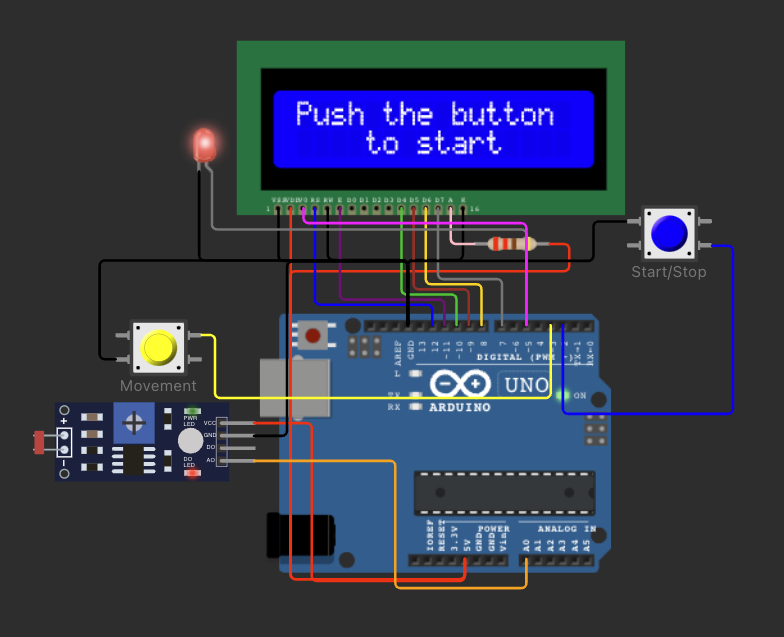
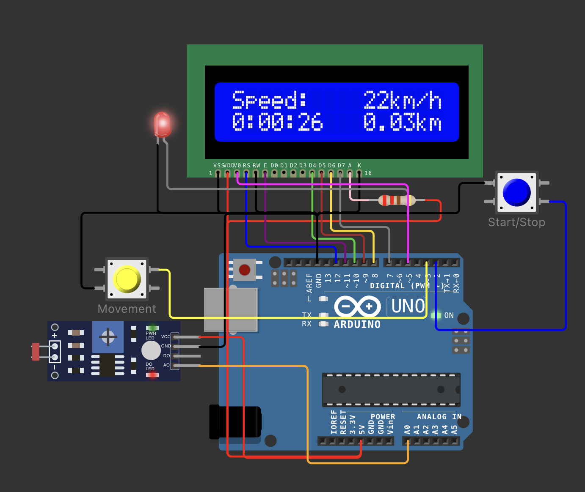
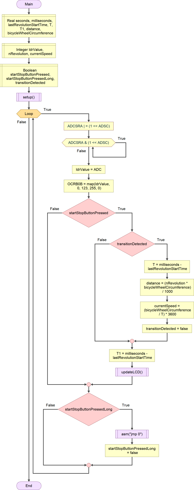
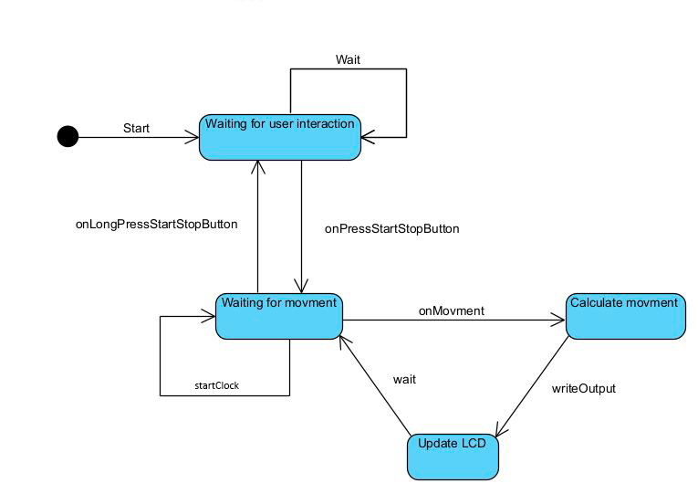

# Arduino Speedometer 🚵
I realized for the computer architecture exam e fully functonal arduino speedometer.
I made the whole project in italian because my university is fully italian.

## Simulation

The project was entirely simulated on Wokwi as I didn't have a physical Arduino for testing.

The system can be easily replicated in real life, all that is needed is a sensor capable of scanning with a duality of states (HIGH-LOW) for one revolution of the wheel.

## Assignment

The assignment was to create a modular system capable of functioning entirely through interrupts. Moreover, it was not possible to use the standard functions of the Arduino library; the functions were written in C, and some in assembly. Bit shifting was employed to set pins to high or low, while timer interrupts were used for timing, and external interrupts for the sensors.

## Preview

Overview of the project

Functioning

## Flow Chart

## State Chart

## Contact Me

If you want more info about the project please contact me on:

IG: @aka_fres /or/
email: francescocalicchio@hotmail.com

